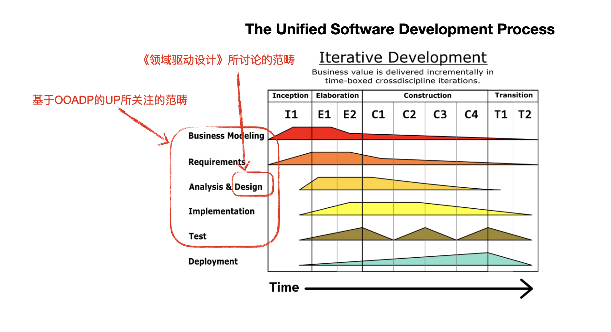
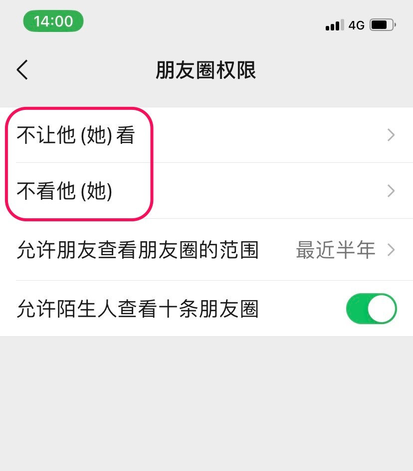
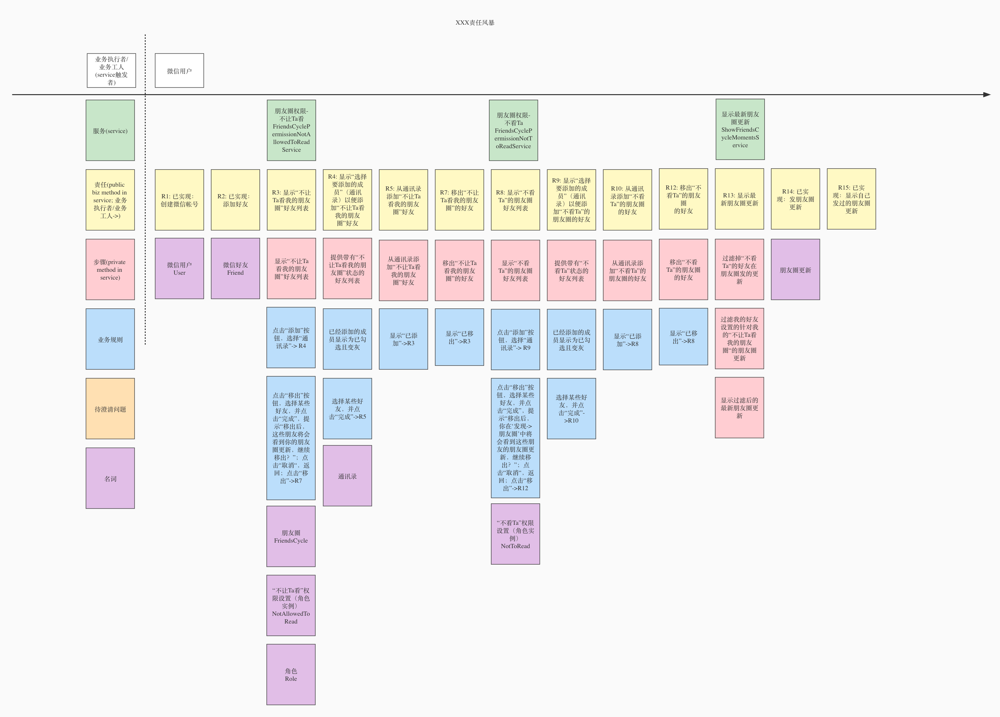
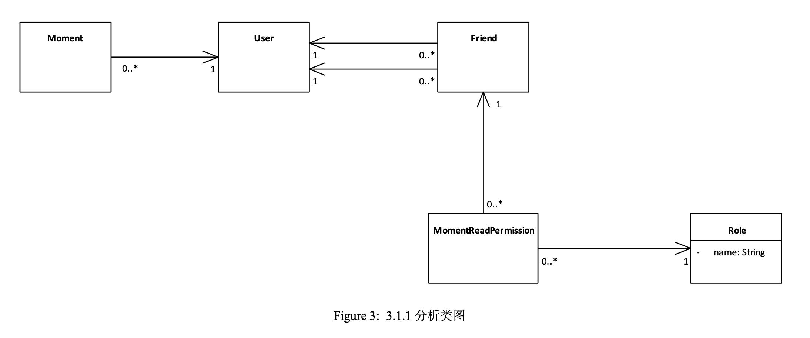
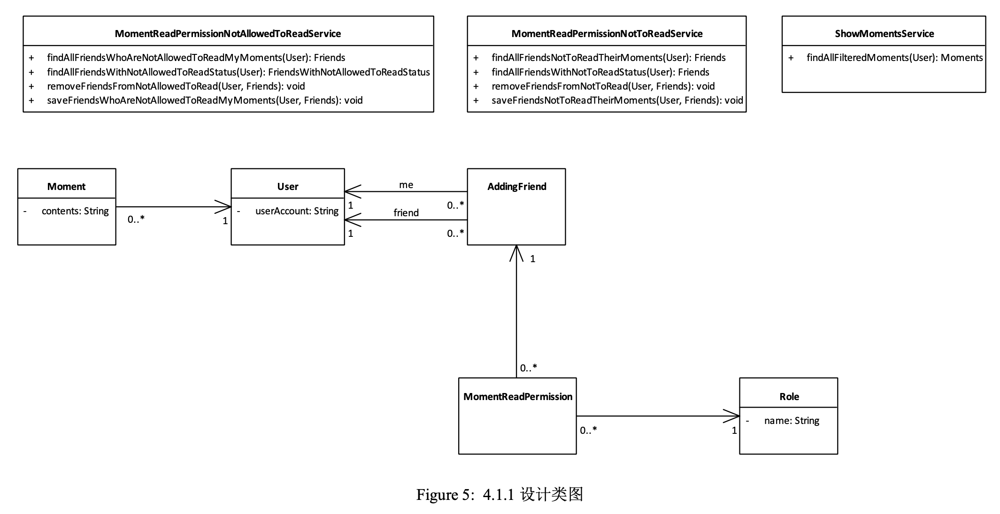
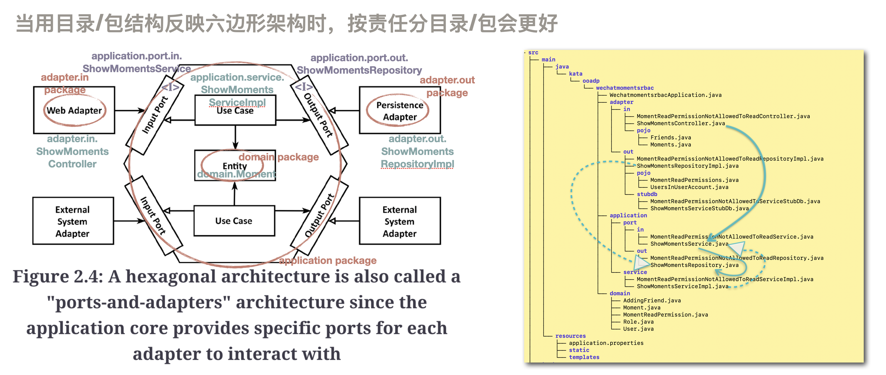

# 用"责任风暴"驱动OOADP和DDD

Eric Evans的《领域驱动设计》一书，主要讨论的是如何做好OOD(Object-Oriented Design, 面向对象设计)，但在面向对象的软件开发过程中，OOD需要基于之前的OOA(Object-Oriented Analysis, 面向对象分析)所产生的分析模型进行设计，而OOA又需要基于之前的需求工作流所产生的用例模型进行分析。这些内容Evans在书中没有讲。所以如果仅读《领域驱动设计》，而没有掌握OOAD整套的方法，是无法将DDD落地的，也无法运用好OOP（Object-Oriented Programming, 面向对象编程）。当需要从一个单体系统中剥离一块业务设计微服务时，不会对这块业务进行软件建模，又何谈运用好DDD呢？从我最近10年接触到的企业内部应用系统的开发人员来看，绝大部分开发人员都缺乏OOADP的实践技能。他们基本上是基于数据库来开发，写出的代码是脚本式的，缺乏面向对象的封装和多态，导致代码难以阅读、扩展和维护。

为了帮助这些开发人员掌握OOADP实践技能，本文以一个大家熟知的"微信朋友圈权限系统"业务为例，参照UP（Unified Process，统一过程）的需求、分析和设计工作流，从业务愿景开始，经历业务用例、责任风暴、分析类图、设计类图，直至样例代码和自动化测试。所经历的这些过程，希望能帮助开发人员掌握OOADP的技能，并为实践DDD打好基础。

目录

1. OOADP操练：微信朋友圈权限系统
2. 业务愿景识别价值和痛点
3. 业务用例识别用户和依赖系统
4. 责任风暴梳理服务、责任和业务规则
5. 分析类图识别分析类及其之间的相互关系
6. 设计类图丰富设计类的属性和方法以指导编程
7. 编写代码和自动化测试

## 1. OOADP操练：微信朋友圈权限系统

为了提升开发人员编写正确的代码和用正确的方法编写代码的实践能力，可以使用逆向工程的思路和面向对象的分析、设计和编程（Object-Oriented Analysis, Design and Programming, OOADP）方法，为微信朋友圈权限（设置->朋友权限->朋友圈）中的“不让他（她）看”和“不看他（她）”两个业务用例进行软件建模，设计出包括属性和方法的分析类和设计类及其之间的关系，并编写样例代码和自动化测试代码，能够实现如下场景（即验收条件）：

1. 微信用户设置“不让他（她）看”后其所设置的微信好友就在朋友圈中看不到前者所发的朋友圈更新
2. 微信用户设置“不看他（她）”后就在朋友圈中看不到其所设置的微信好友所发的朋友圈更新

## 2. 业务愿景识别价值和痛点

业务愿景

- 系统：微信朋友圈权限系统
- 系统业务价值：让微信用户能控制微信朋友圈的权限，使得不让某些朋友看自己发的朋友圈更新，且不看某些朋友发的朋友圈更新
- 目标组织:（略）
- 第一改进成效评判人：微信用户
- 用户当前痛点: 无法控制权限，使得不让某些朋友看自己发的朋友圈更新，且不看某些朋友发的朋友圈更新
- 改进成效：（略）
- 度量指标：（略）

编写"业务愿景"的好处，是能从其中的"用户当前痛点"（甚至可以包括开发人员的当前痛点，比如代码难以扩展），来决定优先做哪些需求。

## 3. 业务用例识别用户和依赖系统

注意：本操练题目所涉及业务并没有所依赖的外部系统，所以上图右侧并没有辅助业务参与者。

## 4. 责任风暴梳理服务、责任和业务规则

Craig Larman所著《UML和模式应用》（第三版）第一章中说："面向对象开发最至关重要的能力，是熟练地为软件对象分配责任。"

既然OOADP最重要的事情是"为软件对象分配责任"，那我们为何不用"责任风暴"来让开发团队与领域专家一起共创软件对象的责任分配，一开始就做最重要的事情呢？

"责任风暴"，就是开发人员与领域专家一起共创软件对象的责任分配的工作坊，以明确开发团队所开发的系统的各个服务应该具备哪些具体责任，以满足业务参与者的业务诉求。

创造"责任风暴"的灵感，来自"事件风暴"（参见我之前有关事件风暴的2个博客：https://www.jianshu.com/p/cf7cfa1dfef9, https://www.jianshu.com/p/724eb6bc8c41）。但前者更专注于针对各种业务场景（包括简单和复杂场景）给软件对象分配责任，而后者更专注于为复杂业务场景的领域建模（参见https://www.jianshu.com/p/724eb6bc8c41）。

"责任风暴"中的"责任"，来源于业务人员或产品经理所梳理的需求，比如原型图和需求文档。

为了节省时间，在有多位开发人员和领域专家参与的"责任风暴"工作坊开始之前，开发负责人可以先和业务人员或产品经理，绘制好"责任风暴"的草图，然后在工作坊中作为集体共创的起点。

"责任风暴"图中的每个"责任"，可以看作是一个系统用例。

通过实践，我认为责任风暴和事件风暴可以相互结合，取长补短。即可以先用责任风暴针对所有用例给软件对象分配"责任"，再选择其中业务逻辑复杂的一个或几个用例，用事件风暴进行领域建模。这样做，就能解决当使用事件风暴共创大量用例时，所出现的繁琐的问题——贴完一遍"事件"，还要再贴一遍与这些"事件"相类似的"命令"，工作量成倍增加。而用"责任风暴"时，只须贴一次"责任"即可。

什么是用例？用例就是从客户和用户的视角，并用他们所使用的语言，描述业务参与者与所开发的系统之间的一系列行为或步骤，从而使系统能满足业务参与者的业务诉求的文字描述。

比如上图中"R3: 显示'不让Ta看我的朋友圈'好友列表"这个用例定义如下：

R3: 显示'不让Ta看我的朋友圈'好友列表：微信用户点击微信中的"设置->朋友权限->朋友圈->不让他（她）看"，系统显示"不让他（她）看我的朋友圈"列表，列出之前添加的所有不希望他们看自己朋友圈更新的好友。

注意这里的"朋友圈更新"，来自微信提示信息，指微信用户发到朋友圈中的所有包括历史和最新的朋友圈图文信息。但在本题目中，朋友圈更新做了简化，只是一行文字。

由上面的例子能够看出，"用例"和"责任"都不是很复杂的概念，而都是描述客户或用户为达到自己的业务目标，与系统所进行的一次交互的文字描述，也就是需求。之所以强调用"文字描述"，而不强调一定要用UML用例图，是为了方便与不懂UML的客户或用户进行沟通。等用文字沟通完成后，可以根据开发人员的需要绘制UML用例图，供开发人员参考。

开发团队与领域专家使用"责任风暴"共创用例模型，可以作为绘制UML业务时序图和系统用例图的前奏，甚至可以替代这两个图。

总之，OOADP最重要的事情是"为软件对象分配责任"，而"责任风暴"中所识别的"责任"又与需求的文字描述"用例"一一对应，由此就能将发散的需求收敛到"服务"的"责任"上，以便进行接下来的OOADP。

本文的"用例"/"责任"的文字描述只列出上面一个例子。剩下的读者可自行完成。

开发人员可以根据微信设置->朋友权限->朋友圈中的“不让他（她）看”和“不看他（她）”的界面，在工作坊中用便利贴共创责任风暴图。

责任风暴图的制作过程，按梳理顺序要点如下：

- 识别责任及其触发者：触发者即所开发系统的服务的触发者，可以包括外部业务执行者，也可以包括内部的业务工人或业务实体。本操练题目的触发者是微信用户。"责任"即系统针对每次触发者所发来的业务请求所履行的业务责任。可以用触发者与系统的每一次交互来识别每个责任，如"显示'不让Ta看我的朋友圈'好友列表"和"从通讯录添加“不让Ta看我的朋友圈”好友"。这些责任，会作为后面设计类图中将责任分配给设计类的重要依据
- 识别服务（每个服务可以对应代码中的`Service`）：识别完责任后，根据业务相关性，可以把"责任"用"服务"来归类，如4个"不让Ta看"的责任，可以归由一个"不让Ta看"的服务来履行
- 识别步骤：即完成一个责任所需的步骤。一个责任可以有多个步骤。需要按照步骤发生的时序从上到下依次排列命令。设计步骤时，需要考虑鉴权和参数合法性校验
- 业务规则：可以把业务规则、跨功能需求（如性能和安全性）、设计约束等业务规格写在相应的“步骤”下面
- 待澄清问题：可以记下需要找领域专家确认的需求问题
- 名词：识别出的名词，可以启发分析类的类名和属性名

有关名词的注意事项：

- 所识别的名词一般有三类：适合作为分析类名的名词、适合作为分析类属性的名词、所依赖的外部系统的名词。
- 一个名词是划为分析类名还是分析类的属性，标准可以是：如果在业务逻辑上该名词所代表的业务概念的实例的数量会动态增减（如"朋友圈更新"`Moment`的实例数量），那么可以将其划为分析类；反之，若实例数量总是保持恒定（如每个"朋友圈更新"的内容的实例数量只有一个），那么可以将其划为分析类的属性
- 可以把名词贴在责任风暴中第一次出现的"责任"下方

注意责任风暴图中的"责任"都用"Rn"编了号，这是为了方便在"业务规则"的跳转描述中指定要跳转到的"责任"。图中缺"R6"和"R11"的原因，是因为这两个责任在后来发现可以合并到R3和R8，所以就缺了这两个编号。由此可见，OOAD的过程充满了随着渐进明细而不断修正前面工作的特点。

## 5. 分析类图识别分析类及其之间的相互关系

- 分析类图中的关联箭头都是单向的，都是从"多"的一方指向"一"的一方。如一个User可以发多个`Moment`（朋友圈更新），而每个`Moment`只能属于一个`User`，所以从`User`到`Moment`是"一对多"的关系。为了便于分页显示`Moment`，且当"多"一方数量很大时无须在`User`类里持有一个很大的`Moment`的列表，所以图中的箭头只是从`Moment`指向`User`，表明`Moment`会持有一个`User`，但`User`不必持有多个`Moment`
- 因为微信加好友是两个微信用户之间的行为，为了管理这样的行为，图中设计了`AddingFriend`分析类（即上图中的`Friend`类，原因见下文），有两个关联的箭头指向`User`，表明在`AddingFriend`类中，会持有两个`User`，一个是`me`，表示微信好友，另一个是`me`的好友`friend`
- 分析类图中类之间的关系不是一蹴而就的，会随着后面对业务理解的深入而不断调整，比如图中`AddingFriend`类，原来叫`Friend`类，但后来感觉还是叫`AddingFriend`更能反映微信加好友的业务，所以更名。`MomentReadPermission`类原来是指向`User`类的，但后来发现朋友圈更新阅读权限其实是与所添加的好友相关的，所以改为指向`AddingFriend`类。上图中的`Friend`类名故意没有更改，出现了与下面设计类图`AddingFriend`类不一致的情况，就是要提醒大家注意这一点。但在实际工作中，还是需要改过来，保持一致
- `Role`类表示角色，在本操练中，这个类有两个实例，即"不让Ta看"和"不看Ta"是两个不同的角色
- 一对好友关系可以有多个角色（即可以同时配置"不让Ta看"和"不看Ta"），而一个角色（如"不让Ta看"）可以对应多对好友关系，即不让多个好友看自己的朋友圈，所以这种"多对多"的关系，可以拆分为两个"一对多"的关系，如图所示，引入了`MomentReadPermission`类来实现两个"一对多"
- 微信朋友圈权限管理是一个简化版的RBAC96框架的RBAC0模型的实现。根据RBAC0模型，应该有`Permission`类与`Role`类发生“多对多”的关系。但本题`Role`（只有"不让Ta看"和"不看Ta"这两个角色）和`Permission`（只有看朋友圈更新这一个权限）是一对一的关系，所以将`Permission`类并入`Role`类。有兴趣的同学可以参考：Sandhu教授1996年提出的RBAC96框架中的RBAC0概念模型。教授的rbac96框架介绍：https://www.profsandhu.com/infs767/infs767fall03/lecture01-2.pdf; RBAC入门教程及实例演示：https://blog.csdn.net/weixin_44911308/article/details/108615759; 教授当年提出rbac96的论文：https://csrc.nist.gov/CSRC/media/Projects/Role-Based-Access-Control/documents/sandhu96.pdf

## 6. 设计类图丰富设计类的属性和方法以指导编程

- 由于本操练题目的业务逻辑都能用CRUD（增删改查）来完成，所以根据习惯，把这些业务逻辑放到`Service`中实现，如上图所示
- 根据"责任风暴"图的"责任"和"服务"的对应关系，可以为每个"服务"设计一个service类，并把该服务下方和右下侧的几个"责任"分配给该`Service`类，如上图`MomentReadPermissionNotAllowedToReadService`类及其4个方法所示
- 在设计类图中，可以为设计类添加属性和方法，如在`Moment`类中添加了`contents`属性

## 7. 编写代码和自动化测试

代码的package组织形式，参考了Tom Hombergs所著的Get Your Hands Dirty on Clean Architecture (https://learning.oreilly.com/library/view/get-your-hands/9781839211966/)第2章所给的六边形架构的图示，如下图所示。

因为已经达成了演示OOADP的目的，所以代码仅实现了以下两个责任（用例）：

- R3: 显示“不让Ta看我的朋友圈”好友列表
- R13: 显示最新朋友圈更新（尚未实现"过滤掉'不看Ta'的好友在朋友圈发的更新"步骤）

代码和针对`Controller`的自动化测试参见：https://github.com/wubin28/wechat-moments-rbac

