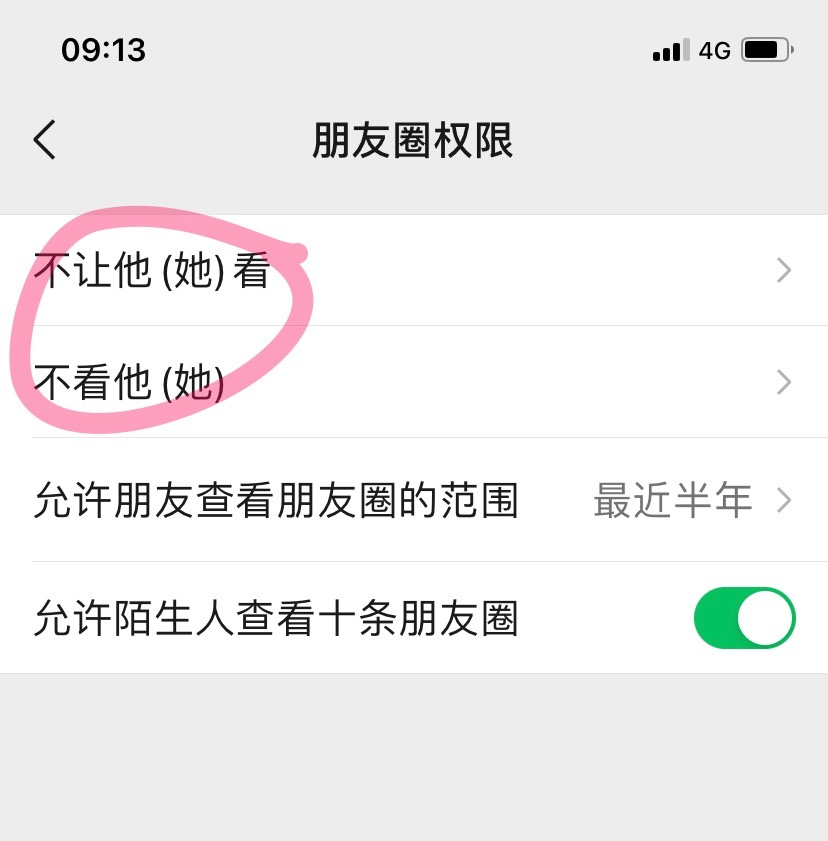

# OOADP操练：微信朋友圈权限系统

使用面向对象的分析、设计和编程（OOADP）方法，为微信朋友圈权限（设置->朋友权限->朋友圈）中的“不让他（她）看”和“不看他（她）”两个业务用例进行软件建模，设计出包括属性和方法的分析类和设计类及其之间的关系，并编写样例代码和自动化测试代码，能够实现如下场景：

1. 微信用户设置“不让他（她）看”后其所设置的微信好友就在朋友圈中看不到前者所发的朋友圈图文
2. 微信用户设置“不看他（她）”后就在朋友圈中看不到其所设置的微信好友所发的朋友圈图文

