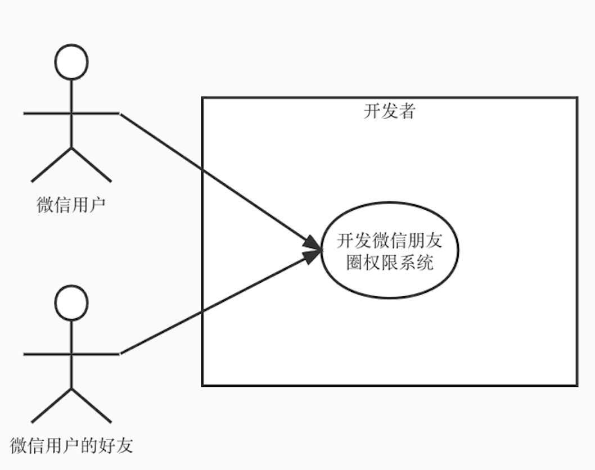

# 用"责任风暴"驱动OOAD和DDD

Eric Evans的《领域驱动设计》一书，主要讨论的是如何做好OOD(Object-Oriented Design, 面向对象设计)，但在面向对象的软件开发过程中，OOD需要基于之前的OOA(Object-Oriented Analysis, 面向对象分析)所产生的分析模型进行设计，而OOA又需要基于之前的需求工作流所产生的用例模型进行分析。这些内容Evans在书中没有讲。所以如果仅读《领域驱动设计》，而没有掌握OOAD整套的方法，是无法将DDD落地的，也无法运用好OOP（Object-Oriented Programming, 面向对象编程）。当需要从一个单体系统中剥离一块业务设计微服务时，不会对这块业务进行软件建模，又何谈运用好DDD呢？从我最近10年接触到的企业内部应用系统的开发人员来看，绝大部分开发人员都缺乏OOADP的实践技能。他们基本上是基于数据库来开发，写出的代码是脚本式的，缺乏面向对象的封装和多态，导致代码难以阅读、扩展和维护。

为了帮助这些开发人员掌握OOADP实践技能，本文以一个大家熟知的"微信朋友圈权限系统"业务为例，参照UP（Unified Process，统一过程）的需求、分析和设计工作流，从业务愿景开始，经历业务用例、责任风暴、分析类图、设计类图，直至样例代码和自动化测试。经历了这些过程，希望能帮助开发人员掌握OOADP的技能，并为实践DDD打好基础。

目录

1. OOADP操练：微信朋友圈权限系统
2. 业务愿景识别价值和痛点
3. 业务用例识别用户和依赖系统
4. 责任风暴梳理服务、责任和业务规则
5. 分析类图识别分析类及其之间的相互关系
6. 设计类图丰富设计类的属性和方法以指导编程
7. 编写代码和自动化测试

## 1. OOADP操练：微信朋友圈权限系统

使用面向对象的分析、设计和编程（OOADP）方法，为微信朋友圈权限（设置->朋友权限->朋友圈）中的“不让他（她）看”和“不看他（她）”两个业务用例进行软件建模，设计出包括属性和方法的分析类和设计类及其之间的关系，并编写样例代码和自动化测试代码，能够实现如下场景：

1. 微信用户设置“不让他（她）看”后其所设置的微信好友就在朋友圈中看不到前者所发的朋友圈图文
2. 微信用户设置“不看他（她）”后就在朋友圈中看不到其所设置的微信好友所发的朋友圈图文

## 2. 业务愿景识别价值和痛点

业务愿景

- 系统：微信朋友圈权限系统
- 系统业务价值：让微信用户能控制微笑朋友圈的权限，使得不让某些朋友看自己发的朋友圈图文，且不看某些朋友发的朋友圈图文
- 目标组织:（略）
- 第一改进成效评判人：微信用户
- 用户当前痛点: 无法控制权限，使得不让某些朋友看自己发的朋友圈图文，且不看某些朋友发的朋友圈图文
- 改进成效：（略）
- 度量指标：（略）

## 3. 业务用例识别用户和依赖系统

注意：本操练题目所涉及业务并没有所依赖的外部系统，所以上图右侧并没有辅助业务参与者。

## 4. 责任风暴梳理服务、责任和业务规则

开发人员可以根据微信设置->朋友权限->朋友圈中的“不让他（她）看”和“不看他（她）”的界面，在工作坊中共创上述用户故事地图。按梳理顺序要点如下：

- 先识别触发者：即所开发系统的服务的触发者，可以包括外部业务执行者，也可以包括内部的业务工人或业务实体
- 再识别责任：即系统针对每次触发者所发来的业务请求所履行的业务责任。这些责任，会作为后面设计类图中将责任分配给设计类的重要依据
- 识别服务（可以对应代码中的service）：识别完责任后，根据业务相关性，可以把"责任"用"服务"来分类，如4个"不让Ta看"的责任，可以归为一个"不让Ta看"的服务
- 识别步骤：即完成一个责任所需的步骤。一个责任可以有多个步骤。需要按照步骤发生的时序从上到下依次排列命令。设计步骤时，需要考虑鉴权和参数合法性校验
- 业务规则：可以把业务规则、跨功能需求（如性能和安全性）、设计约束等业务规格写在相应的“步骤”下面
- 待澄清问题：可以记下需要找领域专家确认的需求问题
- 名词：识别出的名词，可以启发分析类的类名和属性名

有关名词的注意事项：

- 所识别的名词一般有三类：适合作为分析类名的名词、适合作为分析类属性的名词、所依赖的外部系统的名词。
- 一个名词是划为分析类名还是分析类的属性，标准可以是：如果在业务逻辑上该名词所代表的业务概念的实例的数量会动态增减（如"朋友圈更新"Moment的实例数量），那么可以将其划为分析类；反之，若实例数量总是保持恒定（如每个"朋友圈更新"的内容的实例数量只有一个），那么可以将其划为分析类的属性
- 可以把名词贴在责任风暴中第一次出现的责任下方

## 5. 分析类图识别分析类及其之间的相互关系

- 分析类图中的关联箭头都是单向的，都是从"多"的一方指向"一"的一方。如一个User可以发多个Moment（朋友圈更新），而每个Moment只能属于一个User，所以从User到Moment是"一对多"的关系。为了便于分页显示Moment，且无须在User类里持有一个很大的Moment的列表，所以图中的箭头只是从Moment指向User，表明Moment会持有一个User，但User不必持有多个Moment
- 因为微信加好友是两个微信用户之间的行为，为了管理这样的行为，图中设计了AddingFriend分析类，有两个关联的箭头指向User，表明在AddingFriend类中，会持有两个User，一个是me，另一个是me的好友friend
- 分析类图中类之间的关系不是一蹴而就的，会随着后面对业务理解的深入而不断调整，比如图中AddingFriend类，原来叫Friend类，但后来感觉还是叫AddingFriend更能反映加好友的业务，所以更名。MomentReadPermission类原来是指向User类的，但后来发现朋友圈更新阅读权限其实是与所添加的好友相关的，所以改为指向AddingFriend类。上图中的Friend故意没有更改，出现了与下面设计类图AddingFriend类不一致的情况，就是要提醒大家注意这一点
- Role类表示角色，在本操练中，这个类有两个实例，即"不让Ta看"和"不看Ta"是两个不同的角色
- 一对好友关系可以有多个角色（即可以同时配置"不让Ta看"和"不看Ta"），而一个角色（如"不让Ta看"）可以对应多对好友关系，即不让多个好友看自己的朋友圈，所以这种"多对多"的关系，可以拆分为两个"一对多"的关系，如图所示，引入了MomentReadPermission类来实现两个"一对多"
- 微信朋友圈权限管理是一个简化版的RBAC96框架的RBAC0模型的实现。有兴趣的同学可以参考：Sandhu教授1996年提出的RBAC96框架中的RBAC0概念模型。教授的rbac96框架介绍：https://www.profsandhu.com/infs767/infs767fall03/lecture01-2.pdf；RBAC入门教程及实例演示：https://blog.csdn.net/weixin_44911308/article/details/108615759；教授当年提出rbac96的论文：https://csrc.nist.gov/CSRC/media/Projects/Role-Based-Access-Control/documents/sandhu96.pdf

## 6. 设计类图丰富设计类的属性和方法以指导编程

- 由于本操练题目的业务逻辑都能用CRUD（增删改查）来完成，所以根据习惯，把这些业务逻辑放到service中实现。
- 在设计类图中，可以为设计类添加属性和方法

## 7. 编写代码和自动化测试

参见代码：https://github.com/wubin28/wechat-moments-rbac

